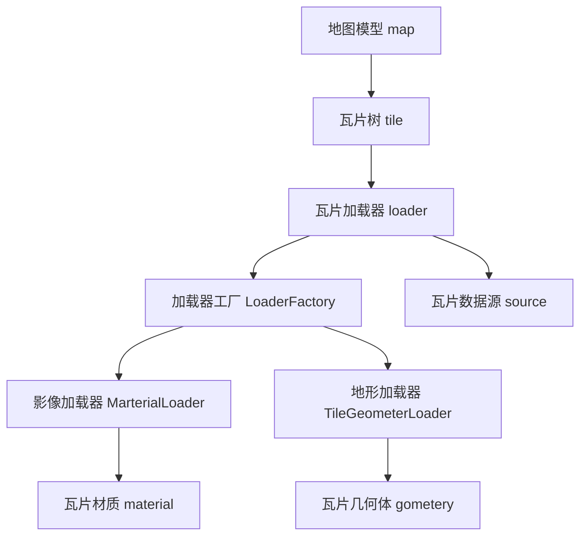

# 概览

three-tile 是基于 threejs 开发三维瓦片地图框架，它提供一个地图三维模型（Mesh）。

## 1. threejs

- threejs 是一个基于 WebGL 的 JavaScript 3D 库，它对 WebGL 进行了封装，使 Web 下开发 3D 应用更加容易。three.js 的官方网站是[http://threejs.org/](http://threejs.org/)。
- three-tile 的开发，需要先了解 threejs 的基础知识。如果你对 threejs 还不熟悉，可以先从它的官方文档和示例开始学习：https://threejs.org/manual/#zh/fundamentals
- three-tile 只提供了模型，很多功能需要使用 threejs 来完成，虽然麻烦了点，但可以充分利用 threejs 的强大生态，threejs 的各种特效、模型都完美衔接。

## 2. WebGIS

- 既然是地图框架开发，那基本的 GIS 知识是必须的。包括地图坐标系、地图投影、地图数据服务、瓦片模型等。

todo: 补充 GIS 基础知识。

## 2. three-tile

three-tile 是基于 threejs 开发的地图三维框架，目标是提供一个轻量级的、易于使用的三维地图模型。

three-tile 采用面向对象设计，使用大量设计模式思想，如抽象工厂、模板方法、代理模式、组合模式等。目前各模块间耦合较少，尽量做到单向依赖，职责分明，架构还算清晰：

- ### 地图模型 map

  地图模型 TileMap 继承于 threejs 的 Mesh，封装了瓦片树、加载器、数据源等对象，增加了地图投影、坐标转换等地图相关的属性方法。它会定时更新瓦片树（目前设置为 1 秒更新 5 次）实现地图的渲染。对地图的绝大部分操作均可通它过完成，普通开发者并不需要深入关注加载器、材质、几何体等模块。

- ### 瓦片树 tile

  瓦片树是 three-tile 的核心，它也继承于 Mesh，实现了一个动态 LOD 模型，作为子模型加入 TileMap。它通过一个四叉树对各层级瓦片进行管理调度，计算其瓦片与摄像机的距离，以决定是否需要细分或合并瓦片（类似 cesium 中的 refine 的"ADD" 和 "REPLACE"），我把这种模型命名为 DLOD(Dynamic Level Of Details)。地图模型 TileMap 会定时调用 Tile.update()更新，计算瓦片的 xyz 坐标，调用瓦片加载器请求瓦片模型。

- ### 瓦片数据源 Source

  瓦片数据源用来定义瓦片的数据来源，包括瓦片数据类型（格式）、url 模板、瓦片层级等信息，以及根据瓦片 xyz 坐标生成具体瓦片 url 的方法。对于标准的 WMTS、TMS 等 标准的 xyz 瓦片服务，仅需提供瓦片数据服务的 url 模板即可，其他特殊编码的数据源(如 bing 瓦片)，可以继承 TileSource 类重写 getUrl 方法实现。three-tile 内置了主流地图厂商瓦片数据源定义，但强烈建议用户自己定义，主要是因为厂商数据源 url 规则会变化或失效，内置数据源不能及时跟上，另外自己定义也非常简单，与 leaflet、cesium 等方法一致。

- ### 瓦片加载器 loader

  瓦片加载器负责瓦片的下载、解析，瓦片树在更新过程中调用它来下载地图数据并生成瓦片模型。它会根据传入的瓦片数据源和瓦片 xyz 坐标，调用影像加载器和地形加载器生成瓦片材质和几何体。由于要兼容各厂家的地图数据，内部有一个加载器工厂（抽象工厂），它能根据地图数据类型取得相应的影像和地形加载器，并调用它们生成瓦片材质和几何体。

- ### 影像加载器 MarterialLoader

  影像加载器负责影像数据的下载、解析，并生成对应的材质，不同格式影像数据对应不同加载器。瓦片加载器调用它实现影像数据的下载和解析。

- ### 地形加载器 TileGeometerLoader

  地形加载器负责地形数据的下载、解析，并生成对应的几何体，不同格式地形数据对应不同地形加载器。瓦片加载器调用它实现地形数据的下载和解析。

- ### 瓦片材质 material

  瓦片材质即瓦片模型的 Material，它比较简单，继承于 threejs 的 MeshStandardMaterial，内建的影像加载器下载数据会创建它。如果你对该材质的渲染效果不满意，可以自己写一个材质替换它，比如用着色器写一些特效。

- ### 瓦片几何体 geomete

  瓦片几何体即瓦片模型的 Geometry，它继承于 threejs 的 BufferGeometry，增加了根据 DEM 数组、根据顶点数据创建瓦片 Geometry 的方法。下载数据后，将数据解析成 DEM 或者顶点数据传入它即可生成瓦片 Geometry。

- ### 插件 plugin
  插件模块主要包括一些非核心的扩展功能，各种格式影像和地形数据加载器也包含在此模块中，运行时注入加载器工厂，实现对对不同厂商不同格式数据的支持。
