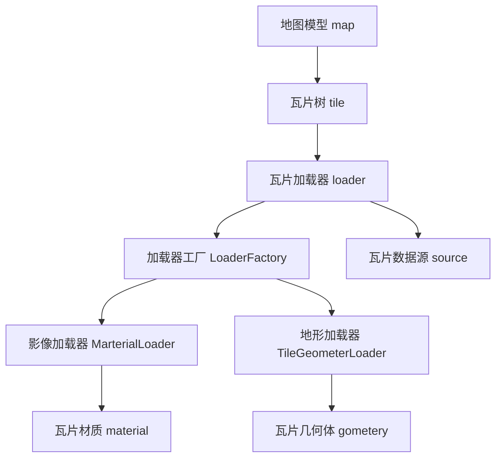

# 概览

three-tile是基于threejs开发三维瓦片地图框架，它提供一个地图三维模型（Mesh）。

## 1. threejs

* threejs是一个基于WebGL的JavaScript 3D库，它对WebGL进行了封装，使Web下开发3D应用更加容易。three.js的官方网站是[http://threejs.org/](http://threejs.org/)。
* three-tile的开发，需要先了解threejs的基础知识。如果你对threejs还不熟悉，可以先从它的官方文档和示例开始学习：https://threejs.org/manual/#zh/fundamental。 
* three-tile只提供了模型，很多功能需要使用threejs来完成，虽然麻烦了点，但可以充分利用threejs的强大生态，threejs的各种特效、模型都完美衔接。

## 2. WebGIS

* 既然是地图框架开发，那基本的GIS知识是必须的。包括地图坐标系、地图投影、地图数据服务、瓦片模型等。

todo: 补充GIS基础知识。

## 2. three-tile

three-tile是基于threejs开发的地图三维框架，目标是提供一个轻量级的、易于使用的三维地图模型。

three-tile 采用面向对象设计，使用大量设计模式思想，如抽象工厂、模板方法、代理模式、组合模式等。目前各模块间耦合较少，尽量做到单向依赖，职责分明，架构还算清晰：

- ### 瓦片树 tile
  瓦片树是three-tile的核心，它通过一个四叉树对各层级瓦片进行管理调度，实现一个动态LOD模型，我把它叫做DLOD(Dynamic Level Of Details)。地图模型会定时调用Tile.update()更新瓦片树，遍历瓦片计算其与摄像机的距离，以决定细分或合并瓦片（类似cesium中的refine的"ADD" 和 "REPLACE"），并计算所需瓦片的xyz坐标，调用瓦片加载器请求瓦片。

- ### 瓦片数据源 Source
  瓦片数据源主要用来定义瓦片的数据来源，包括瓦片地图数据类型、url模板、瓦片层级等信息，包括根据瓦片xyz坐标生成具体瓦片url的方法。对于标准的WMTS、TMS等xyz瓦片数据服务，仅需提供瓦片数据服务的url模板即可，其他特殊编码的数据源(如bing瓦片)，可以继承TileSource类重写getUrl方法。three-tile内置了主流厂商的数据源定义，但强烈建议用户自己定义数据源，主要是因为厂商数据源url规则会变化或失效，内置数据源不能及时跟上，另外自己定义也非常简单，与leaflet、cesium等方法一样。

- ### 瓦片加载器 loader
  瓦片加载器主要负责瓦片的下载、解析，瓦片树在更新过程中调用它来加载数据并生成瓦片模型。瓦片加载器根据Tile传入的瓦片数据源和瓦片xyz坐标，调用影像加载器和地形加载器生成瓦片材质和几何体。由于要兼容各厂家的地图数据，内部会通过一个加载器工厂（抽象工厂），它会根据地图数据类型返回相应的加载器。

- ### 影像加载器 MarterialLoader
  影像加载器主要负责瓦片影像数据的下载、解析，并生成对应的材质，不同格式影像数据对应不同加载器。瓦片加载器调用它实现影像数据的下载和解析。

- ### 地形加载器 TileGeometerLoader  
  地形加载器主要负责瓦片地形数据的下载、解析，并生成对应的几何体，不同格式地形数据对应不同地形加载器。瓦片加载器调用它实现地形数据的下载和解析。
  
- ### 瓦片材质 material
  瓦片材质即瓦片模型的Material，它比较简单，继承于threejs的MeshStandardMaterial，内建的影像加载器下载数据会创建它。如果你对该材质的渲染效果不满意，可以自己写一个材质替换它，比如用着色器写一些特效。
  
- ### 瓦片几何体 geomete   
  瓦片几何体即瓦片模型的Geometry，它继承于threejs的BufferGeometry，增加了根据DEM数组、根据顶点数据创建Geometry的方法。地形加载器下载数据后，将数据解析成DEM或者顶点数据传入它即可生成瓦片Geometry。

- ### 地图模型 map
  地图模型TileMap继承于threejs的Mesh，并封装了瓦片树、加载器、数据源等对象，增加了地图投影、坐标转换等地图相关的属性方法。对地图的绝大部分操作均可通它过完成，普通用户并不需要关注加载器、材质、几何体等模块。它会定时更新瓦片树(目前设置为1秒更新5次)。

- ### 插件 plugin
  插件模块主要包括一些非核心的扩展功能，包括各种格式影像和地形数据加载器，运行时注入加载器工厂，实现对对不同厂商不同格式数据的支持。

