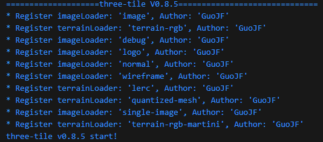

# 自定义地图数据源

<demo html="demo/04.html" title="Example" description="点击地图右上角厂商名称切换地图数据"></demo>

地图创建时需要指定瓦片地图数据源，three-tile 内置了主流厂商的地图数据源定义，但你也可以自定义新的地图数据源，或自行切瓦片、下载离线瓦片使用自己的地图服务。

three-tile 的数据源分两大类：

1. 影像瓦片：即我们通常看到的影像地图瓦片。支持 png、jpg、webp 等格式。
2. 地形瓦片：即高程数据瓦片，用于地形渲染。支持 MapBox 的 terrain-rgb、ArcGis 的 LERC 格式。

three-tile 的地图数据的加载、解析和瓦片模型的创建使用插件架构实现，可以灵活扩展。 目前加载器插件有：geojson、mvt、tif、wirefram、logo、normal、debuge 等。

## 1. 内置数据源

包括：ArcGis、MapBox、google、bing、天地图、中科星图、高德、腾讯等等。这些数据源可以直接使用。数据源定义在 `plugin` 模块。

- MapBoxSource,
- ArcGisSource,
- ArcGisDemSource,
- BingSource,
- GDSource,
- GeoqSource,
- GoogleSource,
- MapTilerSource,
- StadiaSource,
- TDTSource,
- TXSource,
- ZKXTSource

如使用 MapBox 数据源：

```ts
// MapBoxToken 请更换为你自己申请的key
const MAPBOXKEY = "xxxxxxxxxxxxxxxxxxxxxxxxxxxxx";

// mapbox 影像数据源
const mapBoxImgSource = new plugin.MapBoxSource({
  token: MAPBOXKEY,
  dataType: "image",
  style: "mapbox.satellite",
});

// mapbox 高程数据源
const mapBoxDemSource = new plugin.MapBoxSource({
  token: MAPBOXKEY,
  dataType: "terrain-rgb",
  style: "mapbox.terrain-rgb",
  maxLevel: 15,
});

// 创建地图
const map = tt.TileMap.create({
  // 影像数据源
  imgSource: mapBoxImgSource,
  // 地形数据源
  demSource: mapBoxDemSource,
  // 地图投影中心经度
  lon0: 90,
  // 最小缩放级别
  minLevel: 2,
  // 最大缩放级别
  maxLevel: 18,
});
```

:::tip
虽然内置数据源可以直接使用，但建议大家最好还是自己定义，因为地图服务商的数据源 url 常常会发生变化。对于一个开发框架，内置可能会发生变化的规则并不太合理，但为了方便初学者使用还是放在框架里了，也是由于此原因，数据源的定义放在 plugin 模块。
:::

## 2. 自定义数据源定义

three-tile 支持自定义地图瓦片数据源，与 leflet、mapbox、cesium 等用法类似，使用 TileSource 类创建，支持 WMTS、TMS 规范瓦片服务，仅需提供瓦片服务 url 模板即可。如：

```ts
  // 定义opentop数据源
  const opentopImgSource = TileSource.create({
    subdomains: "abc",//子域名
    url: "https://{s}.tile.opentopomap.org/{z}/{x}/{y}.png",// 瓦片url模板
  });
}
```

将 `opentopImgSource` 传入 `TileMap` 的构造函数即可；也可以在运行时修改 `TileMap` 的 `imgSource`或`demSoure` 属性完成地图切换。

数据源的定义可以采用 3 种方式：

1. 工厂函数创建：
2. 继承方式定义：
3. 实现数据源接口：

### 2.1 工厂函数创建：

TileSource 类提供了一个静态方法 create 来创建一个数据源，一般情况下可以使用该方法创建数据源实例（`也可以使用 new TileSource()`）。参数如下：

```ts
interface SourceOptions {
  /** 数据类型标识，指示用哪个加载器加载，默认为"image" */
  dataType?: string;
  /** 数据所有者 */
  attribution?: string;
  /** 瓦片最大级别 */
  minLevel?: number;
  /** 瓦片最小级别 */
  maxLevel?: number;
  /** 投影方式，默认3857 */
  projectionID?: ProjectionType;
  /** 图层显示时的透明度，0-1 */
  opacity?: number;
  /* 数据经纬度范围 [minLon,minLat,maxLon,maxLat] */
  bounds?: [number, number, number, number];
  /** 瓦片url模板 */
  url?: string;
  /** 瓦片url子域 */
  subdomains?: string[] | string;
}
```

参数比较多，但大部分参数都是可选的，一般只需要传入必须的 url 模板即可。url 模板与大部分 gis 系统一致，抄下来即可。

```ts
const mySource = tt.TileSource.create({
  url: "http://127.0.0.1:5500/testSource/img/{z}/{x}/{y}.png",
});

// 设置数据源
map.imgSource = mySource;
// map.reload();//（V0.11.0 后不需要调用）
```

在这里，你可以找到一大批开放的的瓦片数据服务：https://leaflet-extras.github.io/leaflet-providers/preview/

### 2.2 继承方式定义：

对瓦片坐标非 xyz 形式的瓦片服务，可以继承 TileSource，重写 getUrl 函数，按瓦片规则实现 url 的生成。例如内置的 Bing 的数据源：

```ts
/**
 * Bing datasource
 */
export class BingSource extends TileSource {
  public dataType: string = "image";
  public attribution = "Bing[GS(2021)1731号]";
  public style: string = "A";
  public mkt: string = "zh-CN";
  public subdomains = "123";

  public constructor(options?: BingSourceOptions) {
    super(options);
    Object.assign(this, options);
  }

  public getUrl(x: number, y: number, z: number): string {
    // quadKey 函数用于生成 Bing 的 quadkey 算法，此处省略具体实现。
    const key = quadKey(z, x, y);
    return `https://t${this.s}.dynamic.tiles.ditu.live.com/comp/ch/${key}?mkt=${this.mkt}&ur=CN&it=${this.style}&n=z&og=804&cstl=vb`;
  }
}
```

### 2.3 实现接口方式定义（不推荐）：

也可以实现 ISource 接口自定义数据源，不是特殊需求不建议这么做。

::: tip
你可以参考 three-tile 内置数据源的实现，代码写的比较凌乱，没把它作为重点，大家可以参考它自行实现：

https://github.com/sxguojf/three-tile/tree/master/src/plugin/mapSource
:::

## 3. 自定义数据源经纬度范围

如果数据源的经纬度范围不是全球范围，可以自定义范围。

TileSource.bounds：[minLon,minLat,maxLon,maxLat] 用于指定瓦片范围，超出此范围的瓦片将不会被加载，默认为： [-180, -85, 180, 85]，即全球范围，可以修改 bounds 属性，设置瓦片的经纬度范围。

## 4. 瓦片数据类型

three-tile 使用插件架构实现瓦片数据的加载、解析和模型创建，实现对地图数据格式类型的灵活扩展。

`TileSource` 的 `dataType` 属性，用来标识本数据要用哪个加载器插件下载解析，three-tile 内置了多个插件，程序启动时会自动加载，并输出插件信息：



dataType = "image"，即用第一个影像加载器 image 插件加载瓦片。
