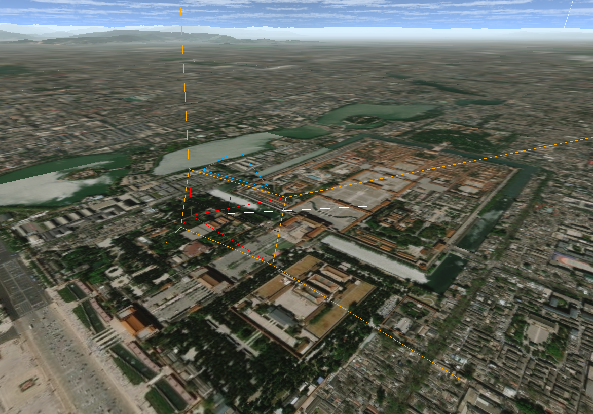

# 防止摄像机碰撞地面

<demo html="demo/07.html" title="example" description="防止摄像机进入地下，接近地面会反弹"></demo>

::: tip 此功能已提供内置插件，直接调用即可。

```ts
// 防止摄像机进入地下
viewer.addEventListener("update", () => {
  plugin.limitCameraHeight(map, viewer.camera);
});
```

:::

## 简单介绍下原理

摄像机碰撞或穿过地面，是三维开发常见的一个问题，游戏中俗称“穿模”。three-tile 中出现这个问题的原因是地面出现在视椎体的近截面（下图黄色矩形）中被剪裁。



地图可以在一定范围内沿 x 轴旋转，当摄像机离地面较近且地图旋转角度较大时，地形会被视椎体的近截面剪裁造成地图残缺。一般可以采用限制摄像机与地面距离，或限制地图旋转角度范围来解决，但用户通常希望地图旋转角度范围越大越好，最好是能像真实场景站在地面上，沿水平方向前看，所以 three-tile 的目标就是，根据地形动态调整俯仰角限制范围，尽可能让用户贴在地面上，沿水平方向前看（实际不可能），地图还保持完整。

::: tip
为什么游戏能做到以模拟人类视角而不会出现地形被剪裁情况？游戏场景俯仰角的旋转是以摄像机（人眼）为中心的，它怎么旋转也不会被剪裁，而地图旋转是以地图中心（地图模型 x 轴）为旋转中心的，俯仰角太大就会出现地形被剪裁。如果你把 three-tile 的 controls 换成第一人称控制器，那就不用担心这个问题了，它永远都不会出现，见 https://sxguojf.github.io/three-tile-example/
:::

### 由于地面碰撞检测需要在每帧渲染时进行，需要找到一种高效的算法：

## 1 根据摄像机局地高度判断

- 思路：直接判断摄像机距地面高度，小于阈值即发生碰撞。
- 问题：摄像机位置在视椎体之外，它的正下方地图瓦片并不会加载，所以无法取得它下方地面的高度。

## 2.检测视线与摄像机碰撞

- 思路：以摄像机位置为起点，沿视线方向发出射线（上图白色线），取得射线与地图模型的交点，计算起点到交点的距离，小于阈值即发生碰撞。
- 问题：在地形复杂的山区，虽然视线与地面交点的距离大于阈值，但一些近处的高地可能已经进入近截面被剪裁了。

## 3. 检测场景近截面与地图模型碰撞

- 思路：取场景近截面矩形（上图黄色矩形），分别从四个顶点沿边的方向发出射线，检测射线与地图模型的交点，如果交点落在边上内则出现了碰撞。想象一下：在近截面焊了一圈钢筋，让地图模型不能进入这个框框。
- 问题：需要进行四次射线法检测，速度较慢。是否能仅判断近截面下沿与地图模型的碰撞？经试验也不行，因为一旦地形已经穿过近截面下沿，底边就不会和模型碰撞了。

## 4. 根据视线与近截面交点距地高度判断

- 思路：先计算视线与近截面的交点（上图白色线起点），再计算该点的距地高度，如果小于阈值则发生碰撞。
- 问题：如果进入一个山谷中，两边山峰很高，视线与近截面的交点距地高度虽然比较大，但两边的山体可能已经进入近截面被剪裁了。

## 测试结果：除 1 外，2、3、4 三种方法都基本可用，但也都有一些问题。经测试：

- 第 1 种方法，无法实现。
- 第 2 种方法，需要取较大的阈值，即摄像机不能贴地面很近，否则很有可能被剪裁。
- 第 3 种方法，可以准确判断，但需要四次射线检测，效率较低。
- 第 4 种方法，不能完全解决问题，但只需一次射线检测，并可以贴近地面，经测试除了地形复杂地区（青藏高原），其它地区可准确判断。

经比较，采用第 4 种方法。

```ts
TileMap.prototype.limitCameraHeight = function (params: LimitCameraHeightParams) {
  const { camera, limitHeight = 0.1 } = params;
  // 摄像机方向与近截面交点的世界坐标
  const checkPoint = camera.localToWorld(new Vector3(0, 0, -camera.near - 0.1));
  // 取该点下方的地面高度
  const info = this.getLocalInfoFromWorld(checkPoint);
  if (info) {
    // 地面高度与该点高度差(世界坐标系下)
    const h = checkPoint.y - info.point.y;
    // 距离低于限制高度时，抬高摄像机
    if (h < limitHeight) {
      const offset = h < 0 ? -h * 1.1 : h / 10;
      const dv = this.localToWorld(this.up.clone()).multiplyScalar(offset);
      camera.position.add(dv);
      return true;
    }
  }
  return false;
};
```
