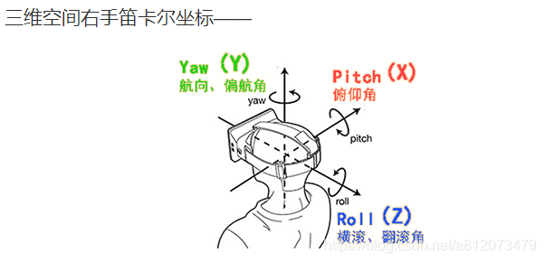

# 第一幅地图

前面的快速开始，已经用最少的代码完成一幅地图的创建，现在我们来完善它。

## 1. 地图创建参数
```ts
    type MapParams = {
        imgSource: ISource[] | ISource; //影像数据源
        demSource?: ISource; //高程数据源，默认undefined
        minLevel?: number; //最小缩放级别，默认0
        maxLevel?: number; //最大缩放级别，默认19
        lon0?: ProjectCenterLongitude; //地图投影中央经线经度，默认0
        loader?: ITileLoader; //地图加载器，默认加载器
        rootTile?: RootTile; //根瓦片
    };

  // 创建地图
  const map = tt.TileMap.create({
    // 影像数据源
    imgSource: new tt.plugin.ArcGisSource(),
    // 地形数据源
    demSource: new tt.plugin.ArcGisDemSource(),
  });
```
| 名称      | 类型                   | 说明                                                                                                                                                                                          |
| --------- | ---------------------- | --------------------------------------------------------------------------------------------------------------------------------------------------------------------------------------------- |
| imgSource | ISource[] \| ISource   | 必选参数，默认为[]，用来指定地图瓦片的影像数据源，如果有多层影像数据可传入影像源数组，多层影像将以叠加混合方式显示。数据源的类型为 ISource，three-tile 已内置主流瓦片数据源，可直接创建使用。 |
| demSource | ISource                | 可选参数，默认为 undefined，用来指定地图瓦片地形数据源，如果为空，地图将不显示地形，与影像数据源一样，可使用内置的地形数据源。                                                                |
| minLevel  | number                 | 可选参数，地图瓦片的最小缩放级别，默认为 0，当瓦片缩放级别小于它时地图瓦片将不再合并。                                                                                                        |
| maxLevel  | number                 | 可选参数，地图瓦片的最最大放级别，默认为 19，当瓦片缩放级别小于它时地图瓦片将不再细分。                                                                                                       |
| lon0      | ProjectCenterLongitude | 可选参数，地图投影中央经线经度，默认为 0，它用来指定投影的中央经线的经度，注意它并不是用来指定地图中心位置的。                                                                                |
| loader    | ITileLoader            | 可选参数，地图数据加载器，默认为内置的 TileLoader 类实例，用来指定用哪个加载器加载数据生成瓦片模型和材质，高级开发者可通过自定义 loader 实现自定义数据加载、瓦片模型创建过程。                |
| rootTile  | RootTile               | 可选参数，地图根瓦片，默认为 0 级瓦片，用来指定从哪个开始创建瓦片树，不需要手工传入。                                                                                                         |

* imgSource/demSource: 用来指定使用谁家的瓦片地图服务的额，先不要管它，后面会专门讲，包括自定义数据源。
* lon0：用来指定地图投影的中央子午线，搞GIS同学应该很熟悉，默认为0°，要把中国放中间，那就设为90，美国为中心为-90。
* minLevel：指定从哪个级别开始加载瓦片，一般从2级开始加载就可以。
* maxLevel：指定到哪个级别开始不再加载瓦片，内部实际上是从这个级别开始瓦片树不再细分，也就是不再加载子瓦片,一般地图服务商瓦片最大到18级。
* loader：指定瓦片使用的加载器，一般默认值即可，除非你想自己重写瓦片加载过程。
* rootTile：指定根瓦片，默认值即可。

## 2. 修改地图启动时的中心坐标

地图启动时，中心默认在0，0坐标，但大多数时候，我们希望它能显示在某个位置，比如以北京为中心，以方位角为180°，斜45°看向故宫。

与二维地图不同，三维场景并不能通过指定中心经纬度和缩放级别对地图进行定位，它需要指定摄像机位置已经摄像机朝向来解决，及你需要确定你是站在哪个位置、朝哪个方向看。摄像机就是你，你站在哪里、朝哪个方向看，地图就显示在哪里。



OK，仍不好理解。不要紧，three-tile使用两个坐标来解决，一个是摄像机坐标，一个是地图中心坐标。移动摄像机到故宫上空：

<demo html="../public/demo01.html"></demo>


```ts
    // 地图中心经纬度高度（km）转为世界坐标
    const centerPostion = map.geo2world(
    new THREE.Vector3(116.40, 39.92, 0)
    );
    // 摄像机经纬度高度（km）转为世界坐标
    const cameraPosition = map.geo2world(
    new THREE.Vector3(116.40, 39.91, 1)
    );
    // 调整摄像机位置
    viewer.camera.position.copy(cameraPosition);
    // 调整地图中心位置
    viewer.controls.target.copy(centerPostion);
    // 通知位置发生变化
    viewer.controls.dispatchEvent({
    type: "change",
    target: viewer.controls,
    });
```      

由于地图数据下载有些慢，耐心等待。例程里有flyTo函数，通过tween动画飞到指定位置，缓解加载过程的无聊等待。


