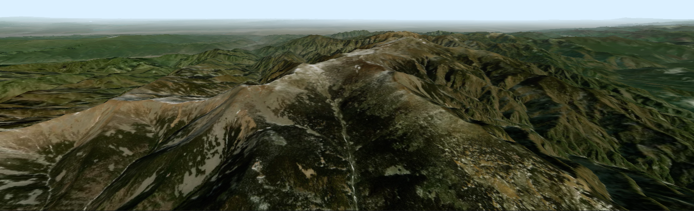

# 快速开始

## 1. npm 安装

```bash
npm i three -S
npm i three-tile -S
```

## 2. yarn 安装

```bash
yarn add three -S
yarn add three-tile -S
```

## 3. script 引入

```html
<script type="importmap">
  {
    "imports": {
      "three": "https://unpkg.com/three@0.165.0/build/three.module.js",
      "three-tile": "https://unpkg.com/three-tile@0.8.5/dist/three-tile.js"
    }
  }
</script>
```

## 4. 使用示例

这是一个最简单的 three-tile 程序，展示了如何在网页中添加一个三维地图，鼠标左键拖动地图，右键旋转地图，滚轮缩放，起步阶段我们使用 script 引入方式，在网页中添加一个三维地图，使用arcgis影像和地形数据:

<demo html="../public/demo00.html"></demo>

代码很简单：
``` ts
  // 创建地图
  const map = tt.TileMap.create({
    // 影像数据源
    imgSource: new tt.plugin.ArcGisSource(),
    // 地形数据源
    demSource: new tt.plugin.ArcGisDemSource(),
  });
  // 地图旋转到xz平面
  map.rotateX(-Math.PI / 2);
  // 初始化场景
  const viewer = new tt.plugin.GLViewer("#map");
  // 地图添加到场景
  viewer.scene.add(map);
```

上面的地图略显丑陋，但运行还是十分流畅的，当你将地图移动旋转到合适的位置时，你会发现几乎能达到以假乱真的效果，下一步我们将一步一步完善它。


